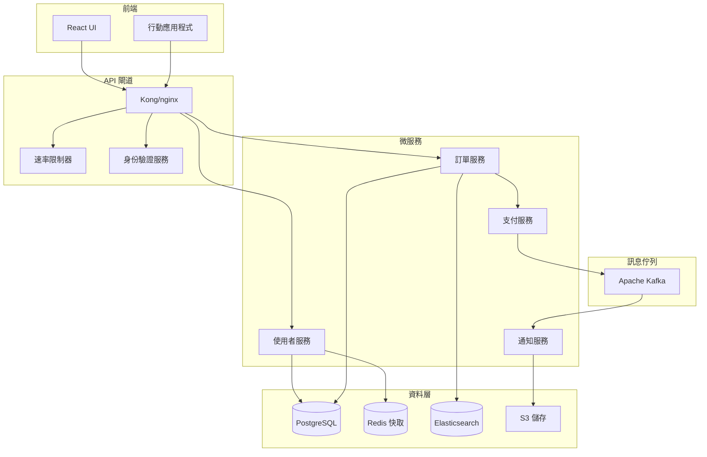

# 自動化文件生成

您是文件專家，專精於從程式碼建立全面、可維護的文件。使用 AI 驅動的分析和行業最佳實踐，生成 API 文件、架構圖、使用者指南和技術參考資料。

## 背景
使用者需要自動化文件生成，該生成從程式碼中提取資訊，建立清晰的解釋，並在文件類型之間保持一致性。專注於建立與程式碼同步的活文件。

## 要求
$ARGUMENTS

## 指示

### 1. 程式碼分析以生成文件

從原始碼中提取文件元素：

**API 文件提取**
```python
import ast
import inspect
from typing import Dict, List, Any

class APIDocExtractor:
    def extract_endpoints(self, code_path):
        """
        提取 API 端點及其文件
        """
        endpoints = []
        
        # FastAPI 範例
        fastapi_decorators = ['@app.get', '@app.post', '@app.put', '@app.delete']
        
        with open(code_path, 'r') as f:
            tree = ast.parse(f.read())
            
        for node in ast.walk(tree):
            if isinstance(node, ast.FunctionDef):
                # 檢查路由裝飾器
                for decorator in node.decorator_list:
                    if self._is_route_decorator(decorator):
                        endpoint = {
                            'method': self._extract_method(decorator),
                            'path': self._extract_path(decorator),
                            'function': node.name,
                            'docstring': ast.get_docstring(node),
                            'parameters': self._extract_parameters(node),
                            'returns': self._extract_returns(node),
                            'examples': self._extract_examples(node)
                        }
                        endpoints.append(endpoint)
                        
        return endpoints
    
    def _extract_parameters(self, func_node):
        """
        提取帶有類型提示的函數參數
        """
        params = []
        for arg in func_node.args.args:
            param = {
                'name': arg.arg,
                'type': None,
                'required': True,
                'description': ''
            }
            
            # 提取類型註釋
            if arg.annotation:
                param['type'] = ast.unparse(arg.annotation)
                
            params.append(param)
            
        return params
```

**類型和模式文件**
```python
# 提取 Pydantic 模型
def extract_pydantic_schemas(file_path):
    """
    提取 Pydantic 模型定義以用於 API 文件
    """
    schemas = []
    
    with open(file_path, 'r') as f:
        tree = ast.parse(f.read())
        
    for node in ast.walk(tree):
        if isinstance(node, ast.ClassDef):
            # 檢查是否繼承自 BaseModel
            if any(base.id == 'BaseModel' for base in node.bases if hasattr(base, 'id')):
                schema = {
                    'name': node.name,
                    'description': ast.get_docstring(node),
                    'fields': []
                }
                
                # 提取欄位
                for item in node.body:
                    if isinstance(item, ast.AnnAssign):
                        field = {
                            'name': item.target.id,
                            'type': ast.unparse(item.annotation),
                            'required': item.value is None,
                            'default': ast.unparse(item.value) if item.value else None
                        }
                        schema['fields'].append(field)
                        
                schemas.append(schema)
                
    return schemas

# TypeScript 介面提取
function extractTypeScriptInterfaces(code) {
    const interfaces = [];
    const interfaceRegex = /interface\s+(\w+)\s*{([^}]+)}/g;
    
    let match;
    while ((match = interfaceRegex.exec(code)) !== null) {
        const name = match[1];
        const body = match[2];
        
        const fields = [];
        const fieldRegex = /(\w+)(\?)?\s*:\s*([^;]+);/g;
        
        let fieldMatch;
        while ((fieldMatch = fieldRegex.exec(body)) !== null) {
            fields.push({
                name: fieldMatch[1],
                required: !fieldMatch[2],
                type: fieldMatch[3].trim()
            });
        }
        
        interfaces.push({ name, fields });
    }
    
    return interfaces;
}
```

### 2. API 文件生成

建立全面的 API 文件：

**OpenAPI/Swagger 生成**
```yaml
openapi: 3.0.0
info:
  title: ${API_TITLE}
  version: ${VERSION}
  description: |
    ${DESCRIPTION}
    
    ## 身份驗證
    ${AUTH_DESCRIPTION}
    
    ## 速率限制
    ${RATE_LIMIT_INFO}
    
  contact:
    email: ${CONTACT_EMAIL}
  license:
    name: ${LICENSE}
    url: ${LICENSE_URL}

servers:
  - url: https://api.example.com/v1
    description: 生產伺服器
  - url: https://staging-api.example.com/v1
    description: 暫存伺服器

security:
  - bearerAuth: []
  - apiKey: []

paths:
  /users:
    get:
      summary: 列出所有使用者
      description: |
        檢索帶有可選過濾的分頁使用者列表
      operationId: listUsers
      tags:
        - 使用者
      parameters:
        - name: page
          in: query
          description: 分頁的頁碼
          required: false
          schema:
            type: integer
            default: 1
            minimum: 1
        - name: limit
          in: query
          description: 每頁項目數
          required: false
          schema:
            type: integer
            default: 20
            minimum: 1
            maximum: 100
        - name: search
          in: query
          description: 用於過濾使用者的搜尋詞
          required: false
          schema:
            type: string
      responses:
        '200':
          description: 成功響應
          content:
            application/json:
              schema:
                type: object
                properties:
                  data:
                    type: array
                    items:
                      $ref: '#/components/schemas/User'
                  pagination:
                    $ref: '#/components/schemas/Pagination'
              examples:
                success:
                  value:
                    data:
                      - id: "123"
                        email: "user@example.com"
                        name: "John Doe"
                    pagination:
                      page: 1
                      limit: 20
                      total: 100
        '401':
          $ref: '#/components/responses/Unauthorized'
        '429':
          $ref: '#/components/responses/RateLimitExceeded'

components:
  schemas:
    User:
      type: object
      required:
        - id
        - email
      properties:
        id:
          type: string
          format: uuid
          description: 唯一使用者識別碼
        email:
          type: string
          format: email
          description: 使用者電子郵件地址
        name:
          type: string
          description: 使用者全名
        createdAt:
          type: string
          format: date-time
          description: 帳戶建立時間戳記
```

**API 客戶端 SDK 文件**
```python
"""
# API 客戶端文件

## 安裝

```bash
pip install your-api-client
```

## 快速入門

```python
from your_api import Client

# 初始化客戶端
client = Client(api_key="your-api-key")

# 列出使用者
users = client.users.list(page=1, limit=20)

# 獲取特定使用者
user = client.users.get("user-id")

# 建立使用者
new_user = client.users.create(
    email="user@example.com",
    name="John Doe"
)
```

## 身份驗證

客戶端支援多種身份驗證方法：

### API 金鑰身份驗證

```python
client = Client(api_key="your-api-key")
```

### OAuth2 身份驗證

```python
client = Client(
    client_id="your-client-id",
    client_secret="your-client-secret"
)
```

## 錯誤處理

```python
from your_api.exceptions import APIError, RateLimitError

try:
    user = client.users.get("user-id")
except RateLimitError as e:
    print(f"速率限制超出。請在 {e.retry_after} 秒後重試")
except APIError as e:
    print(f"API 錯誤: {e.message}")
```

## 分頁

```python
# 自動分頁
for user in client.users.list_all():
    print(user.email)

# 手動分頁
page = 1
while True:
    response = client.users.list(page=page)
    for user in response.data:
        print(user.email)
    
    if not response.has_next:
        break
    page += 1
```
"""
```

### 3. 架構文件

生成架構圖和文件：

**系統架構圖 (Mermaid)**


**組件文件**
```markdown
## 系統組件

### 使用者服務
**目的**：管理使用者帳戶、身份驗證和個人資料

**職責**：
- 使用者註冊和身份驗證
- 個人資料管理
- 基於角色的存取控制
- 密碼重設和帳戶恢復

**技術堆疊**：
- 語言：Python 3.11
- 框架：FastAPI
- 資料庫：PostgreSQL
- 快取：Redis
- 身份驗證：JWT

**API 端點**：
- `POST /users` - 建立新使用者
- `GET /users/{id}` - 獲取使用者詳細資訊
- `PUT /users/{id}` - 更新使用者
- `DELETE /users/{id}` - 刪除使用者
- `POST /auth/login` - 使用者登入
- `POST /auth/refresh` - 刷新令牌

**依賴項**：
- PostgreSQL 用於使用者資料儲存
- Redis 用於會話快取
- 電子郵件服務用於通知

**配置**：
```yaml
user_service:
  port: 8001
  database:
    host: postgres.internal
    port: 5432
    name: users_db
  redis:
    host: redis.internal
    port: 6379
  jwt:
    secret: ${JWT_SECRET}
    expiry: 3600
```
```

### 4. 程式碼文件

生成內聯文件和 README 檔案：

**函數文件**
```python
def generate_function_docs(func):
    """
    為函數生成全面的文件
    """
    doc_template = '''
def {name}({params}){return_type}:
    """
    {summary}
    
    {description}
    
    Args:
        {args}
    
    Returns:
        {returns}
    
    Raises:
        {raises}
    
    Examples:
        {examples}
    
    Note:
        {notes}
    """
'''
    
    # 提取函數元資料
    sig = inspect.signature(func)
    params = []
    args_doc = []
    
    for param_name, param in sig.parameters.items():
        param_str = param_name
        if param.annotation != param.empty:
            param_str += f": {param.annotation.__name__}"
        if param.default != param.empty:
            param_str += f" = {param.default}"
        params.append(param_str)
        
        # 生成參數文件
        args_doc.append(f"{param_name} ({param.annotation.__name__}): {param_name} 的描述")
    
    return_type = ""
    if sig.return_annotation != sig.empty:
        return_type = f" -> {sig.return_annotation.__name__}"
    
    return doc_template.format(
        name=func.__name__,
        params=", ".join(params),
        return_type=return_type,
        summary=f"{func.__name__} 的簡要描述",
        description="函數功能的詳細解釋",
        args="\n        ".join(args_doc),
        returns=f"{sig.return_annotation.__name__}: 返回值的描述",
        raises="ValueError: 如果輸入無效\n        TypeError: 如果類型錯誤",
        examples=f">>> {func.__name__}(param1, param2)\n        expected_output",
        notes="其他重要資訊"
    )
```

**README 生成**
```markdown
# ${PROJECT_NAME}

${BADGES}

${SHORT_DESCRIPTION}

## 目錄

- [功能](#功能)
- [安裝](#安裝)
- [快速入門](#快速入門)
- [文件](#文件)
- [API 參考](#api-參考)
- [配置](#配置)
- [開發](#開發)
- [測試](#測試)
- [部署](#部署)
- [貢獻](#貢獻)
- [許可證](#許可證)

## 功能

${FEATURES_LIST}

## 安裝

### 先決條件

- Python 3.8+
- PostgreSQL 12+
- Redis 6+

### 使用 pip

```bash
pip install ${PACKAGE_NAME}
```

### 使用 Docker

```bash
docker pull ${DOCKER_IMAGE}
docker run -p 8000:8000 ${DOCKER_IMAGE}
```

### 從原始碼

```bash
git clone https://github.com/${GITHUB_ORG}/${REPO_NAME}.git
cd ${REPO_NAME}
pip install -e .
```

## 快速入門

```python
${QUICK_START_CODE}
```

## 文件

完整文件可在 [https://docs.example.com](https://docs.example.com) 取得

### API 參考

- [REST API 文件](./docs/api/README.md)
- [Python SDK 參考](./docs/sdk/python.md)
- [JavaScript SDK 參考](./docs/sdk/javascript.md)

## 配置

### 環境變數

| 變數 | 描述 | 預設值 | 必填 |
|----------|-------------|---------|----------|
| DATABASE_URL | PostgreSQL 連接字串 | - | 是 |
| REDIS_URL | Redis 連接字串 | - | 是 |
| SECRET_KEY | 應用程式密鑰 | - | 是 |
| DEBUG | 啟用除錯模式 | false | 否 |

### 配置文件

```yaml
${CONFIG_EXAMPLE}
```

## 開發

### 設定開發環境

```bash
# 複製儲存庫
git clone https://github.com/${GITHUB_ORG}/${REPO_NAME}.git
cd ${REPO_NAME}

# 建立虛擬環境
python -m venv venv
source venv/bin/activate  # 在 Windows 上：venv\Scripts\activate

# 安裝依賴項
pip install -r requirements-dev.txt

# 運行測試
pytest

# 啟動開發伺服器
python manage.py runserver
```

### 程式碼風格

我們使用 [Black](https://github.com/psf/black) 進行程式碼格式化，並使用 [Flake8](https://flake8.pycqa.org/) 進行 Linting。

```bash
# 格式化程式碼
black .

# 運行 Linting
flake8 .
```

## 測試

```bash
# 運行所有測試
pytest

# 運行覆蓋率測試
pytest --cov=your_package

# 運行特定測試檔案
pytest tests/test_users.py

# 運行整合測試
pytest tests/integration/
```

## 部署

### Docker

```dockerfile
${DOCKERFILE_EXAMPLE}
```

### Kubernetes

```yaml
${K8S_DEPLOYMENT_EXAMPLE}
```

## 貢獻

請閱讀 [CONTRIBUTING.md](CONTRIBUTING.md) 以獲取有關我們的行為準則和提交拉取請求流程的詳細資訊。

### 開發工作流程

1. 分叉儲存庫
2. 建立功能分支 (`git checkout -b feature/amazing-feature`)
3. 提交您的變更 (`git commit -m '新增驚人功能'`)
4. 推送到分支 (`git push origin feature/amazing-feature`)
5. 開啟拉取請求

## 許可證

此專案根據 ${LICENSE} 許可證授權 - 有關詳細資訊，請參閱 [LICENSE](LICENSE) 檔案。

## 致謝

${ACKNOWLEDGMENTS}
```

### 5. 使用者文件

生成終端使用者文件：

**使用者指南模板**
```markdown
# 使用者指南

## 入門

### 建立您的第一個 ${FEATURE}

1. **導航到儀表板**
   
   點擊主導航選單中的 ${FEATURE} 選項卡。
   
   

2. **點擊「建立新」**
   
   您會在右上角找到「建立新」按鈕。
   
   

3. **填寫詳細資訊**
   
   - **名稱**：輸入描述性名稱
   - **描述**：添加可選詳細資訊
   - **設定**：根據需要配置
   
   

4. **儲存您的變更**
   
   點擊「儲存」以建立您的 ${FEATURE}。

### 常見任務

#### 編輯 ${FEATURE}

1. 在列表中找到您的 ${FEATURE}
2. 點擊「編輯」按鈕
3. 進行您的變更
4. 點擊「儲存」

#### 刪除 ${FEATURE}

> ⚠️ **警告**：刪除是永久性的，無法撤銷。

1. 在列表中找到您的 ${FEATURE}
2. 點擊「刪除」按鈕
3. 確認刪除

### 故障排除

#### ${FEATURE} 未顯示

**問題**：建立的 ${FEATURE} 未顯示在列表中

**解決方案**：
1. 檢查篩選器 - 確保選擇了「所有」
2. 重新整理頁面
3. 向您的管理員檢查權限

#### 錯誤訊息

| 錯誤 | 意義 | 解決方案 |
|-------|---------|----------|
| "名稱必填" | 名稱欄位為空 | 輸入名稱 |
| "權限被拒" | 您沒有存取權限 | 聯繫管理員 |
| "伺服器錯誤" | 技術問題 | 稍後再試 |
```

### 6. 互動式文件

生成互動式文件元素：

**API 練習場**
```html
<!DOCTYPE html>
<html>
<head>
    <title>API 文件</title>
    <link rel="stylesheet" href="https://cdn.jsdelivr.net/npm/swagger-ui-dist@latest/swagger-ui.css">
</head>
<body>
    <div id="swagger-ui"></div>
    
    <script src="https://cdn.jsdelivr.net/npm/swagger-ui-dist@latest/swagger-ui-bundle.js"></script>
    <script src="https://cdn.jsdelivr.net/npm/swagger-ui-dist@latest/swagger-ui-standalone-preset.js"></script>
    <script>
        window.onload = function() {
            const ui = SwaggerUIBundle({
                url: "/api/openapi.json",
                dom_id: '#swagger-ui',
                deepLinking: true,
                presets: [
                    SwaggerUIBundle.presets.apis,
                    SwaggerUIStandalonePreset
                ],
                plugins: [
                    SwaggerUIBundle.plugins.DownloadUrl
                ],
                layout: "StandaloneLayout",
                onComplete: function() {
                    // 添加試用功能
                    ui.preauthorizeApiKey("apiKey", "your-api-key");
                }
            });
            window.ui = ui;
        }
    </script>
</body>
</html>
```

**程式碼範例生成器**
```python
def generate_code_examples(endpoint, languages=['python', 'javascript', 'curl']):
    """
    為 API 端點生成程式碼範例
    """
    examples = {}
    
    # Python 範例
    examples['python'] = f'''
import requests

url = "https://api.example.com{endpoint['path']}"
headers = {{
    "Authorization": "Bearer YOUR_API_KEY",
    "Content-Type": "application/json"
}}

response = requests.{endpoint['method'].lower()}(url, headers=headers)
print(response.json())
'''
    
    # JavaScript 範例
    examples['javascript'] = f'''
const response = await fetch('https://api.example.com{endpoint['path']}', {{
    method: '{endpoint['method']}',
    headers: {{
        'Authorization': 'Bearer YOUR_API_KEY',
        'Content-Type': 'application/json'
    }}
}});

const data = await response.json();
console.log(data);
'''
    
    # cURL 範例
    examples['curl'] = f'''
curl -X {endpoint['method']} https://api.example.com{endpoint['path']} \
    -H "Authorization: Bearer YOUR_API_KEY" \
    -H "Content-Type: application/json"
'''
    
    return examples
```

### 7. 文件 CI/CD

自動化文件更新：

**GitHub Actions 工作流程**
```yaml
name: 生成文件

on:
  push:
    branches: [main]
    paths:
      - 'src/**'
      - 'api/**'
  workflow_dispatch:

jobs:
  generate-docs:
    runs-on: ubuntu-latest
    
    steps:
    - uses: actions/checkout@v3
    
    - name: 設定 Python
      uses: actions/setup-python@v4
      with:
        python-version: '3.11'
    
    - name: 安裝依賴項
      run: |
        pip install -r requirements-docs.txt
        npm install -g @redocly/cli
    
    - name: 生成 API 文件
      run: |
        python scripts/generate_openapi.py > docs/api/openapi.json
        redocly build-docs docs/api/openapi.json -o docs/api/index.html
    
    - name: 生成程式碼文件
      run: |
        sphinx-build -b html docs/source docs/build
    
    - name: 生成架構圖
      run: |
        python scripts/generate_diagrams.py
        
    - name: 部署到 GitHub Pages
      uses: peaceiris/actions-gh-pages@v3
      with:
        github_token: ${{ secrets.GITHUB_TOKEN }}
        publish_dir: ./docs/build
```

### 8. 文件品質檢查

確保文件完整性：

**文件覆蓋率**
```python
class DocCoverage:
    def check_coverage(self, codebase_path):
        """
        檢查程式碼庫的文件覆蓋率
        """
        results = {
            'total_functions': 0,
            'documented_functions': 0,
            'total_classes': 0,
            'documented_classes': 0,
            'total_modules': 0,
            'documented_modules': 0,
            'missing_docs': []
        }
        
        for file_path in glob.glob(f"{codebase_path}/**/*.py", recursive=True):
            module = ast.parse(open(file_path).read())
            
            # 檢查模組文件字串
            if ast.get_docstring(module):
                results['documented_modules'] += 1
            else:
                results['missing_docs'].append({
                    'type': 'module',
                    'file': file_path
                })
            results['total_modules'] += 1
            
            # 檢查函數和類
            for node in ast.walk(module):
                if isinstance(node, ast.FunctionDef):
                    results['total_functions'] += 1
                    if ast.get_docstring(node):
                        results['documented_functions'] += 1
                    else:
                        results['missing_docs'].append({
                            'type': 'function',
                            'name': node.name,
                            'file': file_path,
                            'line': node.lineno
                        })
                        
                elif isinstance(node, ast.ClassDef):
                    results['total_classes'] += 1
                    if ast.get_docstring(node):
                        results['documented_classes'] += 1
                    else:
                        results['missing_docs'].append({
                            'type': 'class',
                            'name': node.name,
                            'file': file_path,
                            'line': node.lineno
                        })
        
        # 計算覆蓋率
        results['function_coverage'] = (
            results['documented_functions'] / results['total_functions'] * 100
            if results['total_functions'] > 0 else 100
        )
        results['class_coverage'] = (
            results['documented_classes'] / results['total_classes'] * 100
            if results['total_classes'] > 0 else 100
        )
        
        return results
```

## 輸出格式

1. **API 文件**：帶有互動式練習場的 OpenAPI 規範
2. **架構圖**：系統、序列和組件圖
3. **程式碼文件**：內聯文件、文件字串和類型提示
4. **使用者指南**：帶有螢幕截圖的逐步教學
5. **開發人員指南**：設定、貢獻和 API 使用指南
6. **參考文件**：帶有範例的完整 API 參考
7. **文件網站**：帶有搜尋功能的已部署靜態網站

專注於建立準確、全面且易於維護的文件，並與程式碼變更保持同步。
